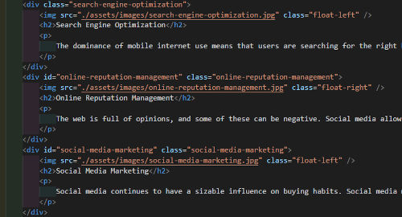
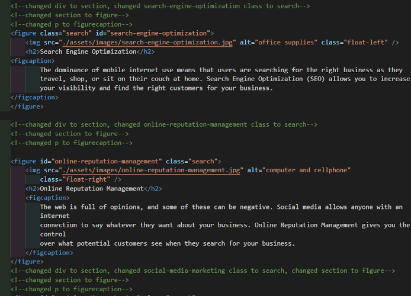
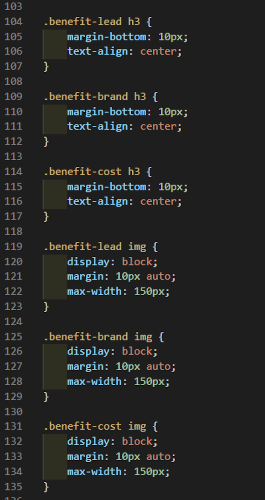
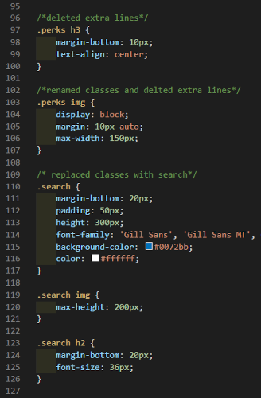

# 01-HTML-CSS-and-Git-Code-Refactor# My first refactor

## Introduction:

In this repo our job was to pretend that a marketing agency hired us to refactor their page. We were given starter code to modify and make accessible. By means of refactoring. When you refactor existing code it makes improvements without ever changing it. 

We created a static website that you can view on this link: [01-HTML-CSS-and-Git-Code-Refactor# My first refactor
](https://killjoyangel.github.io/01-HTML-CSS-and-Git-Code-Refactor/)

Attempted to make lots of commits and pushed to github. 

## Technologies used:
* HTML
* CSS

## Original Code both html and Css

Also took plenty of notes of my changes in both the html and Css

### Original Html

### Changed Html

### Original CSS
 vs

### Changed CSS

## What final product was supposed to look like

